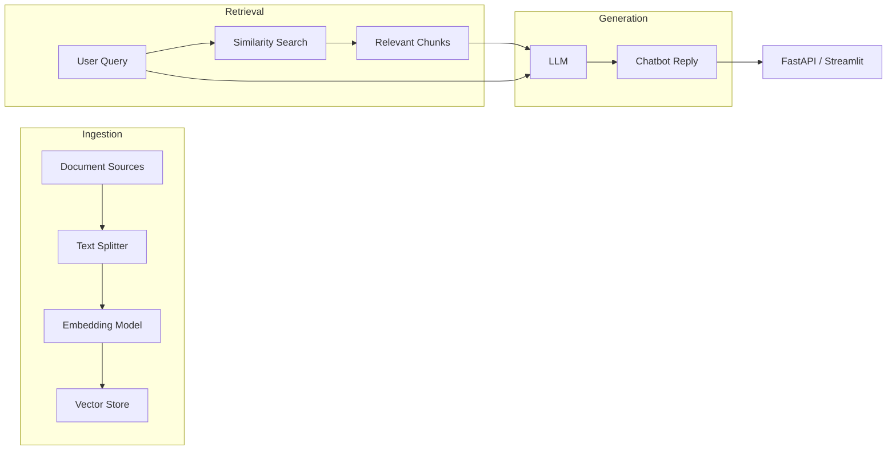

# LangChain Chatbot with Retrieval‑Augmented Generation (RAG)

[](LICENSE)

A minimal yet production‑ready reference implementation of a **chatbot** built on **[LangChain](https://python.langchain.com/)** that leverages **Retrieval‑Augmented Generation (RAG)** to provide up‑to‑date, factual answers from arbitrary document collections.

---

## Table of Contents

- [Features](#features)
- [Architecture Overview](#architecture-overview)
- [Prerequisites](#prerequisites)
- [Installation](#installation)
- [Quick Start](#quick-start)
- [Running the App](#running-the-app)
- [Testing](#testing)
- [How to Contribute](#how-to-contribute)
- [License](#license)
- [Acknowledgements](#acknowledgements)

---

## Features

- **LangChain** integration for LLM orchestration.
- **RAG pipeline**: document ingestion → vector store → similarity search → LLM generation.
- Support for multiple vector‑store back‑ends (FAISS, Chroma, Pinecone, etc.).
- Simple **FastAPI** (or Streamlit) front‑end for interactive chat.
- Configurable via a single `config.yaml` file.
- Dockerfile for reproducible container deployment.
- Test suite with `pytest` and CI ready.

---

## Architecture Overview



- **Document Sources**: local PDFs, markdown files, or remote URLs.
- **Text Splitter**: `RecursiveCharacterTextSplitter` (configurable chunk size).
- **Embedding Model**: OpenAI `text-embedding-ada-002` (or any HuggingFace model).
- **Vector Store**: FAISS by default, interchangeable via LangChain's `VectorStore` interface.
- **Retriever**: `SimilarityRetriever` with configurable `k`.
- **LLM**: OpenAI `gpt-3.5-turbo` (or any compatible model).
- **Chat Prompt**: System prompt that instructs the model to cite sources when possible.

---

## Prerequisites

- Python **3.9** or newer.
- An OpenAI API key (or other LLM provider key) set as `OPENAI_API_KEY` environment variable.
- (Optional) Docker if you prefer containerised execution.

---

## Installation

```bash
# Clone the repository
git clone https://github.com/your‑org/langchain-chatbot.git
cd langchain-chatbot

# Create a virtual environment
python -m venv .venv
source .venv/bin/activate   # on Windows use `.venv\Scripts\activate`

# Install dependencies
pip install -r requirements.txt
```

If you want to use the optional vector‑store back‑ends, install the extra dependencies:

```bash
pip install "langchain[faiss]"   # FAISS (default)
# pip install "langchain[pinecone]"   # Pinecone
# pip install "langchain[chroma]"      # Chroma
```

---

## Quick Start

1. **Add your documents** to the `data/` folder (PDF, txt, md, etc.).
2. **Run the ingestion script** to build the vector store:
   ```bash
   python scripts/ingest.py
   ```
   This will:
   - Load documents.
   - Split them into chunks.
   - Compute embeddings.
   - Persist the vector index under `vector_store/`.
3. **Start the chatbot server**:
   ```bash
   uvicorn app.main:app --reload
   ```
4. Open your browser at `http://127.0.0.1:8000/docs` (FastAPI Swagger UI) or `http://127.0.0.1:8501` (Streamlit) depending on the front‑end you selected.

You can now ask questions like:

> *"What are the key takeaways from the 2023 annual report?"*

The bot will retrieve the most relevant passages, feed them to the LLM, and return a concise answer with source citations.

---

## Running the App

### FastAPI (REST API)

```bash
uvicorn app.main:app --host 0.0.0.0 --port 8000
```

- **POST** `/chat` with JSON `{ "question": "Your question" }`.
- Response includes `answer` and an array of `sources`.

### Streamlit UI (optional)

```bash
streamlit run ui/app.py
```

The UI provides a simple chat interface and displays source excerpts beneath each answer.

---

## Testing

```bash
pytest -v
```

The test suite covers:
- Document ingestion.
- Vector‑store creation.
- Retriever‑LLM integration.
- API endpoint responses.

CI pipelines (GitHub Actions) run these tests on every push.

---

## How to Contribute

Contributions are welcome! Follow these steps:

1. Fork the repository.
2. Create a feature branch:
   ```bash
   git checkout -b feature/your‑feature
   ```
3. Make your changes and ensure the test suite passes.
4. Open a Pull Request with a clear description of the change.
5. Follow the existing code style (PEP 8, Black, isort).

See `CONTRIBUTING.md` for detailed guidelines.

---

## License

This project is licensed under the **MIT License** – see the `LICENSE` file for details.

---

## Acknowledgements

- **LangChain** – for the powerful LLM orchestration primitives.
- **OpenAI** – for the embedding and chat models used in the reference implementation.
- The open‑source community for the vector‑store back‑ends and utilities.

---

*Happy coding!*