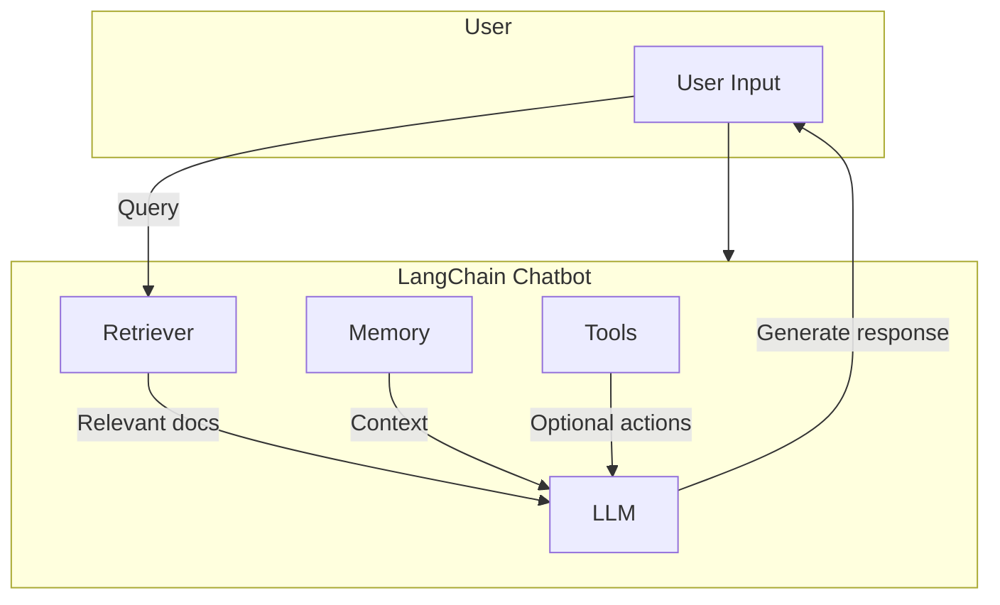

# LangChain Chatbot

## Overview

**LangChain‑Chatbot** is a minimal yet extensible reference implementation of a conversational AI assistant built on top of **[LangChain](https://github.com/hwchase17/langchain)**.  It demonstrates how to combine:

- **Large Language Models (LLMs)** for natural language generation.
- **Retrieval‑Augmented Generation (RAG)** pipelines that fetch relevant context from external knowledge sources.
- **Memory** mechanisms to maintain multi‑turn conversation state.

The repository is deliberately lightweight so developers can quickly grasp the core concepts, then extend the bot with custom retrievers, tools, or UI layers.

---

## Table of Contents

1. [Features](#features)
2. [Architecture Overview](#architecture-overview)
3. [Getting Started](#getting-started)
   - [Prerequisites](#prerequisites)
   - [Installation](#installation)
   - [Running the Demo](#running-the-demo)
4. [Configuration](#configuration)
5. [Extending the Bot](#extending-the-bot)
6. [Testing](#testing)
7. [Contributing](#contributing)
8. [License](#license)

---

## Features

- **LLM‑agnostic** – works with OpenAI, Anthropic, Cohere, Llama‑cpp, etc.
- **RAG support** – plug‑in any `BaseRetriever` (FAISS, Chroma, Pinecone, Elastic, etc.).
- **Conversation memory** – `ConversationBufferMemory` (or any `BaseMemory`).
- **Tool integration** – easy to add external tools (e.g., calculator, web search).
- **Dockerised** – optional Dockerfile for reproducible environments.
- **CI workflow** – linting, type checking and unit tests.

---

## Architecture Overview



- **Retriever** fetches documents based on the user query.
- **Memory** stores the conversation history and injects it into the prompt.
- **LLM** receives the combined prompt (user query + retrieved docs + memory) and generates a response.
- **Tools** (optional) can be called by the LLM to perform actions beyond text generation.

---

## Getting Started

### Prerequisites

- **Python ≥ 3.9**
- An API key for the LLM provider you intend to use (e.g., `OPENAI_API_KEY`).
- (Optional) Vector store backend if you want to use a persistent retriever.

### Installation

```bash
# Clone the repository
git clone https://github.com/your-org/langchain-chatbot.git
cd langchain-chatbot

# Create a virtual environment (recommended)
python -m venv .venv
source .venv/bin/activate   # on Windows use `.venv\Scripts\activate`

# Install dependencies
pip install -r requirements.txt
```

> **Tip:** The project uses `poetry` as an alternative dependency manager. Run `poetry install` if you prefer.

### Running the Demo

A minimal interactive CLI is provided:

```bash
python -m chatbot.main
```

You will be prompted for a question. The bot will retrieve relevant passages from the sample dataset (`data/documents/`) and answer using the configured LLM.

To launch the optional FastAPI server:

```bash
uvicorn chatbot.api:app --reload
```

Visit `http://127.0.0.1:8000/docs` for the OpenAPI UI.

---

## Configuration

Configuration is handled via **Pydantic** settings (`chatbot/config.py`).  Environment variables are the primary source of truth:

| Variable | Description | Example |
|----------|-------------|---------|
| `LLM_PROVIDER` | Which LLM backend to use (`openai`, `anthropic`, `cohere`, `llama_cpp`, …) | `openai` |
| `OPENAI_API_KEY` | API key for OpenAI (required if `LLM_PROVIDER=openai`) | `sk-…` |
| `RETRIEVER_TYPE` | Type of vector store (`faiss`, `chroma`, `pinecone`, `elastic`) | `faiss` |
| `EMBEDDING_MODEL` | Embedding model name for the retriever | `text-embedding-ada-002` |
| `MEMORY_TYPE` | Memory implementation (`buffer`, `summary`, `conversation`) | `buffer` |

You can create a `.env` file at the project root:

```dotenv
LLM_PROVIDER=openai
OPENAI_API_KEY=sk-xxxxxxxxxxxxxxxxxxxx
RETRIEVER_TYPE=faiss
EMBEDDING_MODEL=text-embedding-ada-002
MEMORY_TYPE=buffer
```

The settings are automatically loaded on import.

---

## Extending the Bot

### Adding a New Retriever

1. Implement a class inheriting from `langchain.retrievers.base.BaseRetriever`.
2. Register it in `chatbot/retrievers/__init__.py`.
3. Update the `RETRIEVER_TYPE` mapping in `chatbot/config.py`.

### Adding a Tool

Create a tool following LangChain's `Tool` interface, e.g. a weather API:

```python
from langchain.tools import BaseTool

class WeatherTool(BaseTool):
    name = "weather"
    description = "Get the current weather for a city."

    def _run(self, city: str) -> str:
        # call external API …
        return f"The weather in {city} is sunny."
```

Add the tool to the `toolkit` in `chatbot/main.py` and the LLM will be able to invoke it.

---

## Testing

The project includes a suite of unit tests using **pytest**:

```bash
pytest -q
```

Run the type‑checking and linting steps as part of CI:

```bash
mypy .
ruff check .
```

---

## Contributing

Contributions are welcome! Please follow these steps:

1. **Fork** the repository.
2. Create a **feature branch** (`git checkout -b feat/your-feature`).
3. Write tests for new functionality.
4. Ensure the existing test suite passes.
5. Open a **Pull Request** with a clear description of the changes.

Read the full contribution guidelines in `CONTRIBUTING.md`.

---

## License

Distributed under the **MIT License**. See `LICENSE` for more information.

---

## Acknowledgements

- The LangChain team for the powerful framework.
- The open‑source community for vector store backends and embedding models.

---

*Happy building with LangChain!*