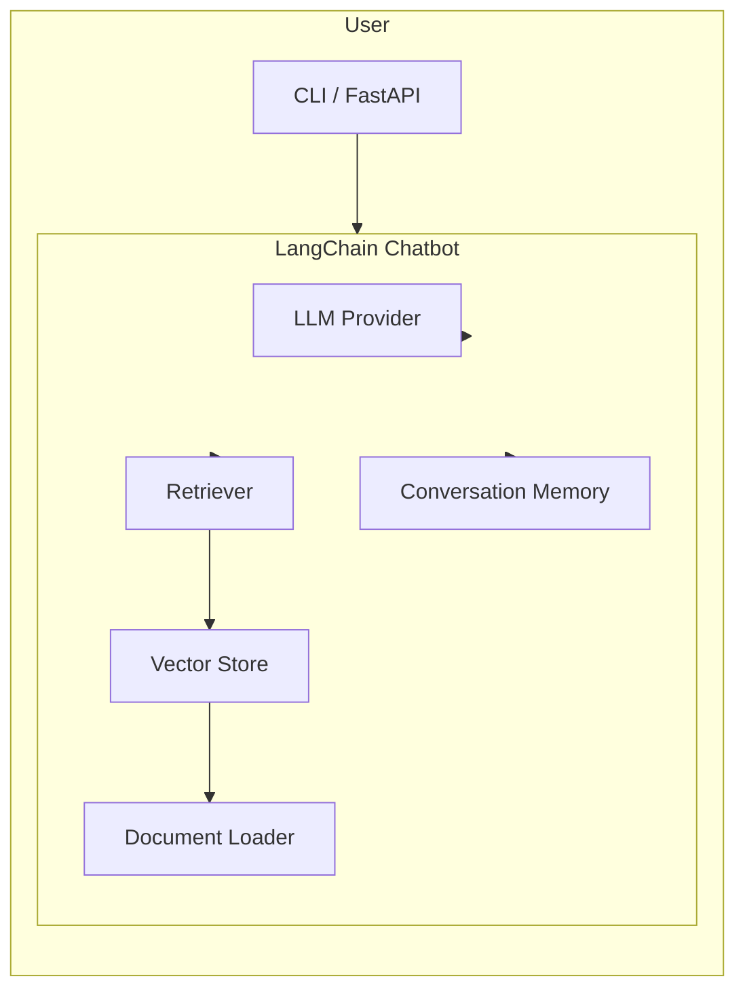

# LangChain Chatbot with Retrieval-Augmented Generation (RAG)


A **modular, extensible chatbot** built on top of **[LangChain](https://github.com/langchain-ai/langchain)** that demonstrates **Retrieval‑Augmented Generation (RAG)**.  The bot can answer questions using a combination of LLM generation and external knowledge sources (vector stores, document loaders, etc.).

---

## Table of Contents

- [Features](#features)
- [Architecture Overview](#architecture-overview)
- [Getting Started](#getting-started)
  - [Prerequisites](#prerequisites)
  - [Installation](#installation)
  - [Running the Demo](#running-the-demo)
- [Configuration](#configuration)
- [Extending the Bot](#extending-the-bot)
- [Testing](#testing)
- [Contributing](#contributing)
- [License](#license)
- [References](#references)

---

## Features

- **LangChain core**: leverages `Chains`, `Agents`, and `Memory` abstractions.
- **RAG pipeline**: integrates document loaders, vector stores (FAISS, Chroma, Pinecone, etc.) and a retriever to augment LLM responses with up‑to‑date information.
- **Modular design**: swap LLM providers (OpenAI, Anthropic, Llama‑Cpp, etc.) and vector store back‑ends with minimal code changes.
- **Chat memory**: optional conversation memory (ConversationBufferMemory) for context‑aware dialogues.
- **CLI & FastAPI interfaces**: interact via terminal or expose a REST endpoint.
- **Docker support**: containerised for reproducible environments.

---

## Architecture Overview



1. **User input** is received via the CLI or HTTP endpoint.
2. The **Retriever** queries the vector store (FAISS/Chroma/etc.) using the user query.
3. Retrieved documents are passed to the **LLM** as context.
4. The LLM generates a response, optionally enriched by **Memory**.
5. The response is returned to the user.

---

## Getting Started

### Prerequisites

- **Python 3.9+**
- **Poetry** (recommended) or `pip`
- An LLM API key (e.g., OpenAI `OPENAI_API_KEY`).
- Optional: vector‑store service credentials (Pinecone, Weaviate, etc.) if you plan to use a remote store.

### Installation

```bash
# Clone the repository
git clone https://github.com/your-org/langchain-chatbot.git
cd langchain-chatbot

# Install dependencies using Poetry (recommended)
poetry install

# Or using pip
pip install -r requirements.txt
```

### Running the Demo

#### 1️⃣ CLI mode

```bash
poetry run python -m chatbot.cli
```

You will be prompted for a question. The bot will retrieve relevant chunks and generate an answer.

#### 2️⃣ FastAPI server

```bash
poetry run uvicorn chatbot.api:app --host 0.0.0.0 --port 8000
```

- **POST** `/chat` with JSON payload `{ "query": "Your question" }`
- Response: `{ "answer": "Generated answer" }`

---

## Configuration

Configuration is driven by the `config.yaml` file (or environment variables). Key sections:

```yaml
llm:
  provider: openai            # openai | anthropic | huggingface
  model: gpt-3.5-turbo
  temperature: 0.7

retriever:
  vector_store: faiss          # faiss | chroma | pinecone | weaviate
  index_path: ./data/faiss_index
  top_k: 5

memory:
  enabled: true
  type: conversation_buffer

documents:
  source_dir: ./data/documents
  loader: text               # text | pdf | csv | markdown
```

You can also override settings via environment variables, e.g., `OPENAI_API_KEY`, `PINECONE_API_KEY`.

---

## Extending the Bot

### Adding a New Document Loader

1. Create a subclass of `langchain.document_loaders.base.BaseLoader`.
2. Implement the `load()` method to return a list of `Document` objects.
3. Register the loader in `chatbot/loaders/__init__.py` and reference it in `config.yaml`.

### Swapping the Vector Store

Replace the `FAISS` implementation with another store by:

```python
from langchain.vectorstores import Chroma
vectorstore = Chroma.from_documents(docs, embedding)
```

Update `config.yaml` accordingly.

### Custom Chains or Agents

Leverage LangChain's `Chain` or `Agent` classes to add tool‑use, function calling, or multi‑step reasoning.  See LangChain's official docs for patterns.

---

## Testing

Unit and integration tests live under the `tests/` directory. Run them with:

```bash
poetry run pytest -v
```

Coverage report:

```bash
poetry run pytest --cov=chatbot
```

---

## Contributing

Contributions are welcome! Please follow these steps:

1. **Fork** the repository.
2. Create a feature branch: `git checkout -b feature/your-feature`.
3. Ensure code style with `black` and `ruff` (configured in `pyproject.toml`).
4. Write tests for new functionality.
5. Open a Pull Request describing the changes.

See `CONTRIBUTING.md` for detailed guidelines.

---

## License

This project is licensed under the **MIT License** – see the `LICENSE` file for details.

---

## References

- LangChain Documentation: https://python.langchain.com/
- Retrieval‑Augmented Generation: https://arxiv.org/abs/2005.11401
- OpenAI API: https://platform.openai.com/docs/api-reference/introduction
- FAISS: https://github.com/facebookresearch/faiss

---

*Happy building with LangChain!*