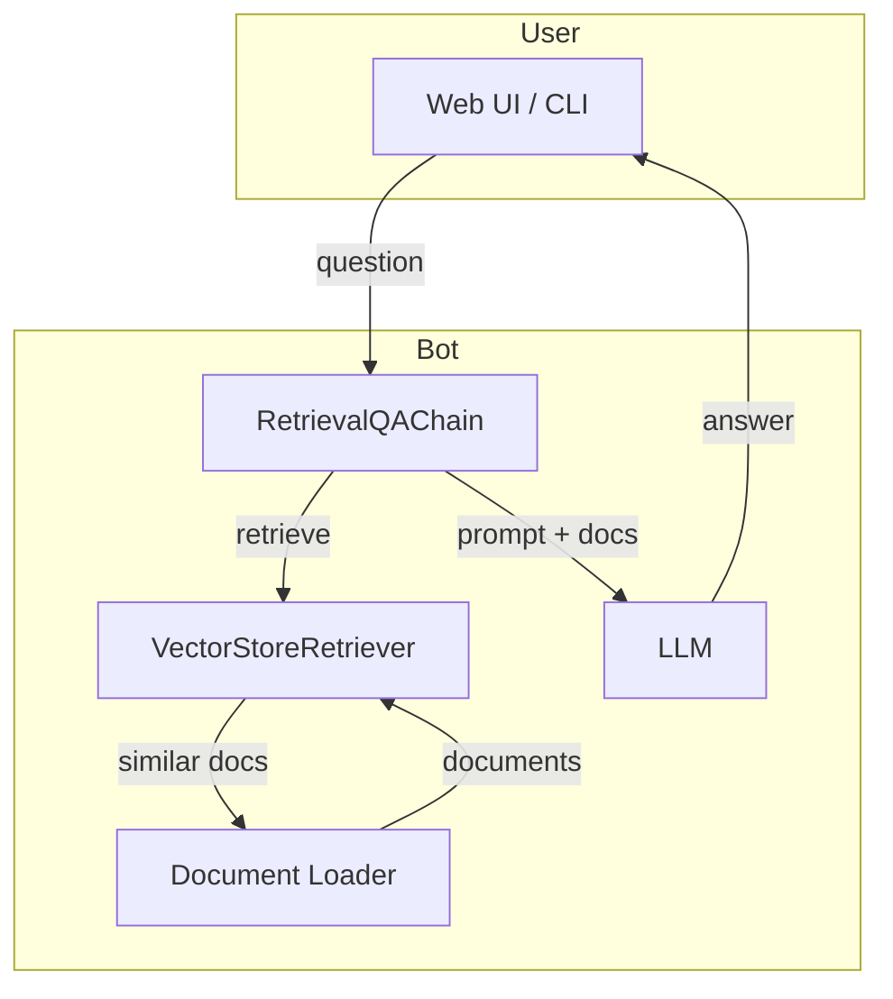

# LangChain Chatbot with Retrieval‑Augmented Generation (RAG)


## Overview

This repository provides a **minimal yet production‑ready** example of a chatbot built on top of **[LangChain](https://github.com/langchain-ai/langchain)** that leverages **Retrieval‑Augmented Generation (RAG)**.  The bot can:

- Answer user queries using a large language model (LLM).
- Retrieve relevant documents from a vector store to ground its responses in factual data.
- Stream responses in real‑time (useful for UI integrations).
- Be extended with custom tools, memory, and callbacks.

The goal of this project is to serve as a **starter kit** for developers who want to quickly spin‑up a LangChain‑based chatbot, understand the RAG workflow, and contribute improvements.

---

## Table of Contents

1. [Features](#features)
2. [Architecture Diagram](#architecture-diagram)
3. [Prerequisites](#prerequisites)
4. [Installation](#installation)
5. [Configuration](#configuration)
6. [Running the Application](#running-the-application)
7. [Testing the Bot](#testing-the-bot)
8. [Extending the Bot](#extending-the-bot)
9. [Contributing](#contributing)
10. [License](#license)

---

## Features

- **LLM‑agnostic** – works with OpenAI, Anthropic, Cohere, Llama‑2, etc.
- **Vector Store integration** – supports FAISS (local), Chroma, Pinecone, Weaviate, and others via LangChain's `VectorStoreRetriever`.
- **Document loaders** – ingest PDFs, Markdown, CSV, plain text, and web pages.
- **Streaming output** – optional streaming for UI/CLI.
- **Prompt templating** – clear separation of system, user, and retrieval prompts.
- **Docker support** – containerised for reproducible environments.
- **Comprehensive tests** – unit tests for loader, retriever, and chain logic.

---

## Architecture Diagram



---

## Prerequisites

| Requirement | Version |
|-------------|---------|
| Python      | >=3.9   |
| pip         | latest  |
| Docker (optional) | >=20.10 |
| An OpenAI/Anthropic/… API key (depending on the LLM you choose) |

---

## Installation

```bash
# Clone the repository
git clone https://github.com/FrancoisBib/langchain-chatbot.git
cd langchain-chatbot

# Create a virtual environment (recommended)
python -m venv .venv
source .venv/bin/activate   # on Windows: .venv\Scripts\activate

# Install dependencies
pip install -r requirements.txt
```

If you prefer Docker:

```bash
docker build -t langchain-chatbot .
```

---

## Configuration

Create a `.env` file at the project root (add it to `.gitignore` if you fork the repo). Example:

```dotenv
# LLM configuration
OPENAI_API_KEY=sk-****************
# Choose the model – e.g., gpt-4o-mini, claude-3-sonnet-20240229, etc.
LLM_MODEL=gpt-4o-mini

# Vector store configuration (FAISS is default, no extra env needed)
# For remote stores, provide the relevant keys, e.g.:
# PINECONE_API_KEY=...
# PINECONE_ENV=...

# Document ingestion path (relative to repo root)
DOCS_PATH=./data

# Retrieval settings
TOP_K=4   # number of retrieved chunks per query
```

---

## Running the Application

### 1️⃣ Ingest Documents

```bash
python scripts/ingest.py --source ./data
```

The script loads supported file types, creates embeddings (default `OpenAIEmbeddings`), and persists a FAISS index under `./vector_store/faiss_index`.  Adjust the embedding model via the `EMBEDDING_MODEL` environment variable if needed.

### 2️⃣ Start the Chatbot (CLI)

```bash
python app.py
```

You will be prompted for a question.  The bot streams its answer as it is generated.

### 3️⃣ Start the Chatbot (Web UI – optional)

```bash
uvicorn server:app --reload
```

Open `http://127.0.0.1:8000` in your browser.  The UI is a lightweight React‑based front‑end located in `frontend/`.

---

## Testing the Bot

```bash
pytest -q
```

Key test modules:
- `tests/test_ingest.py` – validates document loading and vector store creation.
- `tests/test_chain.py` – checks that the RetrievalQA chain returns a non‑empty answer and respects `TOP_K`.

---

## Extending the Bot

### Add a New Document Loader
1. Create a subclass of `BaseLoader` in `src/loaders/`.
2. Register it in `src/loaders/__init__.py`.
3. Update `scripts/ingest.py` to accept a `--loader` flag.

### Switch to a Remote Vector Store
Replace the FAISS store in `src/vector_store.py` with e.g. `Pinecone`:
```python
from langchain.vectorstores import Pinecone
vectorstore = Pinecone.from_documents(
    docs,
    embedding,
    index_name="langchain-chatbot",
    namespace="default",
)
```
Remember to add the corresponding environment variables.

### Use a Different LLM
Update `src/llm.py` – the `get_llm()` helper reads `LLM_MODEL` and selects the appropriate LangChain wrapper.

---

## Contributing

We welcome contributions! Please follow these steps:

1. **Fork the repository**.
2. **Create a feature branch**:
   ```bash
   git checkout -b feature/your-feature-name
   ```
3. **Make your changes** and ensure the test suite passes.
4. **Submit a Pull Request** with a clear description of the change.
5. Follow the existing code style (black, isort, flake8) – you can run the formatter with:
   ```bash
   make fmt
   ```

For major changes, open an issue first to discuss the design.

---

## License

This project is licensed under the **MIT License** – see the `LICENSE` file for details.

---

## Acknowledgements

- **LangChain** – the core framework powering the retrieval and LLM orchestration.
- **OpenAI**, **Anthropic**, **Cohere**, **HuggingFace** – for providing the underlying language models.
- The open‑source community for the numerous document loaders and vector store adapters.
