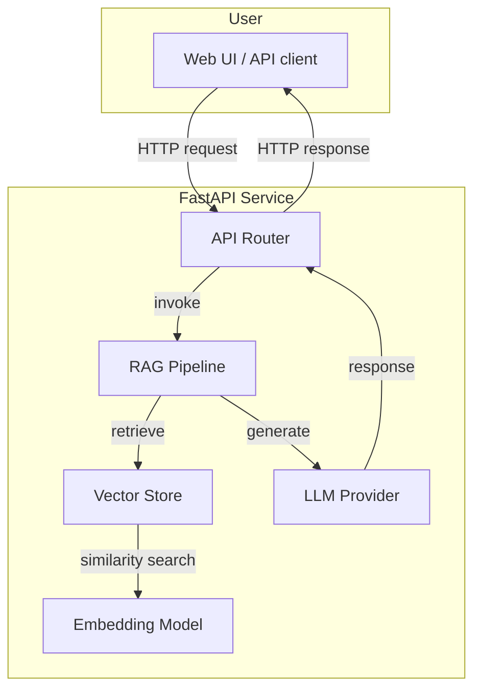

# LangChain Chatbot with Retrieval‑Augmented Generation (RAG)

[](LICENSE)

A **minimal yet production‑ready** chatbot built on **[LangChain](https://python.langchain.com/)** that demonstrates **Retrieval‑Augmented Generation (RAG)**. The bot retrieves relevant context from a document store and feeds it to a language model, enabling accurate, up‑to‑date answers.

---

## Table of Contents

- [Features](#features)
- [Architecture Overview](#architecture-overview)
- [Quick Start (Local)](#quick-start-local)
- [Running with Docker](#running-with-docker)
- [Configuration](#configuration)
- [Testing](#testing)
- [Contributing](#contributing)
- [License](#license)

---

## Features

- **RAG pipeline**: Combine vector similarity search with LLM generation.
- **Modular design**: Easily swap out LLMs, embeddings, or vector stores.
- **FastAPI backend** with OpenAPI schema for rapid integration.
- **Docker support** for reproducible environments.
- **Extensive type hints** and **unit tests**.
- **Contribution‑ready**: CI workflow, linting, and documentation guidelines.

---

## Architecture Overview



- **Vector Store**: Currently uses **FAISS** (in‑memory) but can be replaced with **Pinecone**, **Weaviate**, etc.
- **Embedding Model**: OpenAI `text-embedding-ada-002` (configurable via environment).
- **LLM Provider**: OpenAI `gpt-3.5-turbo` by default; supports any LangChain‑compatible LLM.

---

## Quick Start (Local)

### Prerequisites

- Python **3.10** or newer
- `git` and `pip`
- An **OpenAI API key** (or another LLM provider key) stored in `OPENAI_API_KEY`

### Installation

```bash
# Clone the repository
git clone https://github.com/your‑org/langchain-chatbot.git
cd langchain-chatbot

# Create a virtual environment
python -m venv .venv
source .venv/bin/activate  # on Windows: .venv\Scripts\activate

# Install dependencies
pip install -r requirements.txt
```

### Prepare the knowledge base

Place your source documents (PDF, TXT, MD, etc.) in the `data/` directory. Then run the ingestion script:

```bash
python scripts/ingest.py
```

The script will:
1. Load documents using LangChain loaders.
2. Split them into chunks.
3. Compute embeddings.
4. Persist the FAISS index to `faiss_index/`.

### Run the API server

```bash
uvicorn app.main:app --reload
```

Open `http://127.0.0.1:8000/docs` to explore the automatically generated OpenAPI UI.

---

## Running with Docker

A multi‑stage Dockerfile is provided for reproducible builds.

```bash
# Build the image
docker build -t langchain-chatbot .

# Run the container (replace <your‑key> with your OpenAI key)
docker run -e OPENAI_API_KEY=<your‑key> -p 8000:8000 langchain-chatbot
```

The service will be reachable at `http://localhost:8000`.

---

## Configuration

Configuration is driven by environment variables. Create a `.env` file at the project root or export variables directly.

| Variable | Description | Default |
|----------|-------------|---------|
| `OPENAI_API_KEY` | Your OpenAI API key. | *(required)* |
| `LLM_MODEL` | Model name for the LLM provider. | `gpt-3.5-turbo` |
| `EMBEDDING_MODEL` | Embedding model identifier. | `text-embedding-ada-002` |
| `VECTOR_STORE` | Vector store implementation (`faiss`, `pinecone`, …). | `faiss` |
| `CHUNK_SIZE` | Number of tokens per text chunk. | `1000` |
| `CHUNK_OVERLAP` | Overlap between chunks (tokens). | `200` |

The `Config` class in `app/config.py` loads these variables with **pydantic‑settings** for type safety.

---

## Testing

Unit and integration tests are located in the `tests/` directory. Run them with:

```bash
pytest -vv
```

Coverage is enforced at **90 %** in the CI pipeline.

---

## Contributing

We welcome contributions! Please follow these steps:

1. **Fork** the repository and create a feature branch.
2. Follow the existing code style (black, isort, flake8). You can run the formatter with `make format`.
3. Add or update tests for new functionality.
4. Ensure all tests pass and coverage remains above 90 %.
5. Open a Pull Request with a clear description of the changes.

### Development workflow

```bash
# Install development extras
pip install -e .[dev]

# Run linting & formatting checks
make lint
make format

# Run the test suite
make test
```

See `CONTRIBUTING.md` for detailed guidelines.

---

## License

This project is licensed under the **MIT License** – see the [LICENSE](LICENSE) file for details.
