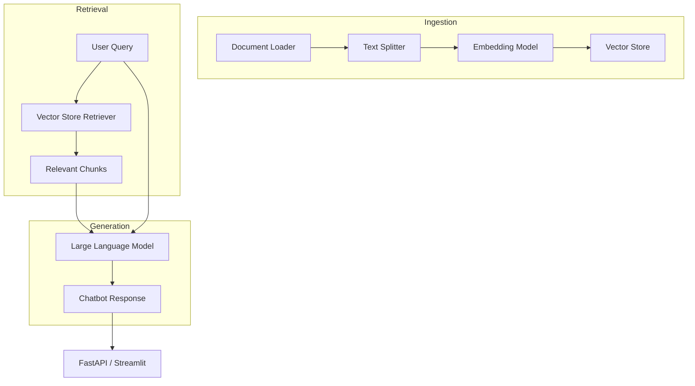

# LangChain Chatbot with Retrieval‑Augmented Generation (RAG)

[](LICENSE)
[](https://www.python.org/downloads/)

A **minimal, production‑ready chatbot** built on top of **[LangChain](https://github.com/langchain-ai/langchain)** that demonstrates **Retrieval‑Augmented Generation (RAG)**. The bot can answer questions over arbitrary document collections (PDF, Markdown, plain text, …) by combining a vector store retriever with a large language model (LLM).

---

## Table of Contents

1. [Project Overview](#project-overview)
2. [Features](#features)
3. [Architecture](#architecture)
4. [Installation](#installation)
5. [Quick Start](#quick-start)
6. [Usage Guide](#usage-guide)
7. [Running the API / UI](#running-the-api--ui)
8. [Development & Testing](#development--testing)
9. [Contributing](#contributing)
10. [License](#license)

---

## Project Overview

The repository contains a **self‑contained example** that shows how to:

* **Load** documents from a directory (PDF, TXT, MD, CSV, …).
* **Chunk** them into manageable pieces using LangChain's `RecursiveCharacterTextSplitter`.
* **Embed** the chunks with an OpenAI, Cohere, or locally hosted embedding model.
* **Store** the embeddings in a vector store (FAISS, Chroma, Pinecone, …).
* **Retrieve** the most relevant chunks for a user query.
* **Combine** the retrieved context with a LLM (OpenAI `gpt-4o`, Anthropic `claude-3`, Llama‑2, etc.) to generate a grounded answer.
* **Expose** the chatbot via a simple FastAPI endpoint and an optional Streamlit UI.

All heavy‑lifting is delegated to LangChain components, making the code easy to extend or replace.

---

## Features

| ✅ | Feature |
|---|---|
| ✅ | **RAG pipeline** – document ingestion → chunking → embedding → vector store → retrieval → LLM generation |
| ✅ | **Pluggable LLM & embeddings** – switch between OpenAI, Anthropic, HuggingFace, Ollama, etc. |
| ✅ | **Multiple vector stores** – FAISS (local), Chroma (local), Pinecone, Weaviate, etc. |
| ✅ | **FastAPI backend** – single POST `/chat` endpoint returning streamed responses |
| ✅ | **Streamlit UI** – optional web UI for interactive testing |
| ✅ | **Docker support** – one‑click containerised deployment |
| ✅ | **Typed configuration** – Pydantic settings for environment variables |
| ✅ | **Unit & integration tests** – powered by `pytest` and `httpx` |
| ✅ | **CI workflow** – GitHub Actions lint, type‑check, and test on push |

---

## Architecture



* **Document loaders** (`langchain.document_loaders`) automatically detect file types.
* **Splitters** (`RecursiveCharacterTextSplitter`) ensure each chunk respects LLM token limits.
* **Embeddings** are abstracted behind `langchain.embeddings` – you only need to set `EMBEDDING_MODEL`.
* **Vector stores** implement the `VectorStoreRetriever` interface; the default is FAISS for zero‑config local runs.
* **LLM** is instantiated via `langchain.llms` (or `ChatOpenAI` for chat‑style models).

---

## Installation

### Prerequisites

* Python **3.9+**
* An OpenAI / Anthropic / HuggingFace API key (or a local model if you prefer) – see the *Configuration* section.

### Using pip

```bash
# Clone the repository
git clone https://github.com/FrancoisBib/langchain-chatbot.git
cd langchain-chatbot

# Create a virtual environment (recommended)
python -m venv .venv
source .venv/bin/activate   # on Windows: .venv\Scripts\activate

# Install dependencies
pip install -r requirements.txt
```

### Docker (optional)

```bash
# Build the image
docker build -t langchain-chatbot .

# Run the container (replace .env with your own configuration file)
docker run -p 8000:8000 --env-file .env langchain-chatbot
```

---

## Quick Start

1. **Create a `.env` file** at the project root (example below).  
2. **Place your documents** in `data/` (any supported format).  
3. **Run the ingestion script** to build the vector store.
4. **Start the API** and chat!

```bash
# .env example
OPENAI_API_KEY=sk-xxxxxxxxxxxxxxxxxxxx
EMBEDDING_MODEL=openai
LLM_MODEL=gpt-4o
VECTOR_STORE=faiss   # alternatives: chroma, pinecone

# Ingest documents (runs once or when you add new files)
python scripts/ingest.py

# Launch the FastAPI server
uvicorn app.main:app --host 0.0.0.0 --port 8000
```

You can now POST to `http://localhost:8000/chat`:

```bash
curl -X POST http://localhost:8000/chat \
     -H "Content-Type: application/json" \
     -d '{"question": "What is RAG?"}'
```

Or open the optional UI:

```bash
streamlit run ui/chat_ui.py
```

---

## Usage Guide

### Configuration (`config.py`)

All runtime options are loaded from environment variables via **Pydantic Settings**.  The most common variables are:

| Variable | Description | Default |
|---|---|---|
| `OPENAI_API_KEY` | Your OpenAI secret key. Required for OpenAI models. | – |
| `EMBEDDING_MODEL` | Embedding provider (`openai`, `cohere`, `huggingface`, `ollama`). | `openai` |
| `LLM_MODEL` | LLM identifier (`gpt-4o`, `claude-3-sonnet-20240229`, `llama2:7b`). | `gpt-4o` |
| `VECTOR_STORE` | Vector store backend (`faiss`, `chroma`, `pinecone`). | `faiss` |
| `CHUNK_SIZE` | Number of characters per chunk (default 1000). | `1000` |
| `CHUNK_OVERLAP` | Overlap between chunks to preserve context. | `200` |

### Ingestion script (`scripts/ingest.py`)

```python
from pathlib import Path
from langchain_community.document_loaders import DirectoryLoader
from langchain.text_splitter import RecursiveCharacterTextSplitter
from langchain.vectorstores import FAISS
from langchain.embeddings import OpenAIEmbeddings

# 1️⃣ Load documents
loader = DirectoryLoader("data", glob="**/*.{txt,md,pdf,docx}")
documents = loader.load()

# 2️⃣ Split into chunks
splitter = RecursiveCharacterTextSplitter(chunk_size=1000, chunk_overlap=200)
chunks = splitter.split_documents(documents)

# 3️⃣ Embed & store
embeddings = OpenAIEmbeddings()
vectorstore = FAISS.from_documents(chunks, embeddings)
vectorstore.save_local("vectorstore")
print("✅ Ingestion completed – vector store saved to ./vectorstore")
```

### Chat endpoint (`app/api/chat.py`)

```python
from fastapi import APIRouter, Body
from pydantic import BaseModel
from langchain.chains import RetrievalQA
from app.core import get_retriever, get_llm

router = APIRouter()

class ChatRequest(BaseModel):
    question: str
    chat_history: list[tuple[str, str]] = []  # optional

@router.post("/chat")
async def chat(request: ChatRequest):
    retriever = get_retriever()
    llm = get_llm()
    qa = RetrievalQA.from_chain_type(llm=llm, retriever=retriever)
    answer = qa.run(request.question)
    return {"answer": answer}
```

The `get_retriever` and `get_llm` helpers read the configuration and return the appropriate LangChain objects.

---

## Running the API / UI

### FastAPI (backend only)

```bash
uvicorn app.main:app --reload
```

Open http://localhost:8000/docs for the automatically generated OpenAPI UI.

### Streamlit UI (frontend)

```bash
streamlit run ui/chat_ui.py
```

The UI provides a simple chat window, displays retrieved sources, and lets you switch the LLM model on the fly (if you have multiple keys).

---

## Development & Testing

### Install development extras

```bash
pip install -r requirements-dev.txt
```

### Run the test suite

```bash
pytest -v
```

The repository includes:

* **Unit tests** for the ingestion pipeline (`tests/test_ingest.py`).
* **Integration tests** that spin up a temporary FastAPI client (`tests/test_api.py`).

### Linting & Type checking

```bash
# Lint with Ruff (or flake8)
ruff check .

# Type checking with mypy
mypy .
```

### Pre‑commit hooks (recommended)

```bash
echo "repo" > .git/hooks/pre-commit
# Use the provided configuration in .pre-commit-config.yaml
pre-commit install
```

---

## Contributing

Contributions are welcome! Please follow these steps:

1. **Fork** the repository.
2. Create a **feature branch** (`git checkout -b feat/your-feature`).
3. Write **tests** for new functionality.
4. Ensure the CI pipeline passes (`ruff`, `mypy`, `pytest`).
5. Open a **Pull Request** with a clear description of the change.

See `CONTRIBUTING.md` for detailed guidelines.

---

## License

This project is licensed under the **MIT License** – see the [LICENSE](LICENSE) file for details.

---

## Acknowledgements

* **LangChain** – the core framework powering the RAG pipeline.
* **OpenAI**, **Anthropic**, **Cohere**, **Ollama** – for providing LLM and embedding APIs.
* **FAISS**, **Chroma**, **Pinecone** – for vector store implementations.
* The open‑source community for countless examples and tutorials that inspired this minimal reference implementation.

---

*Happy coding!*