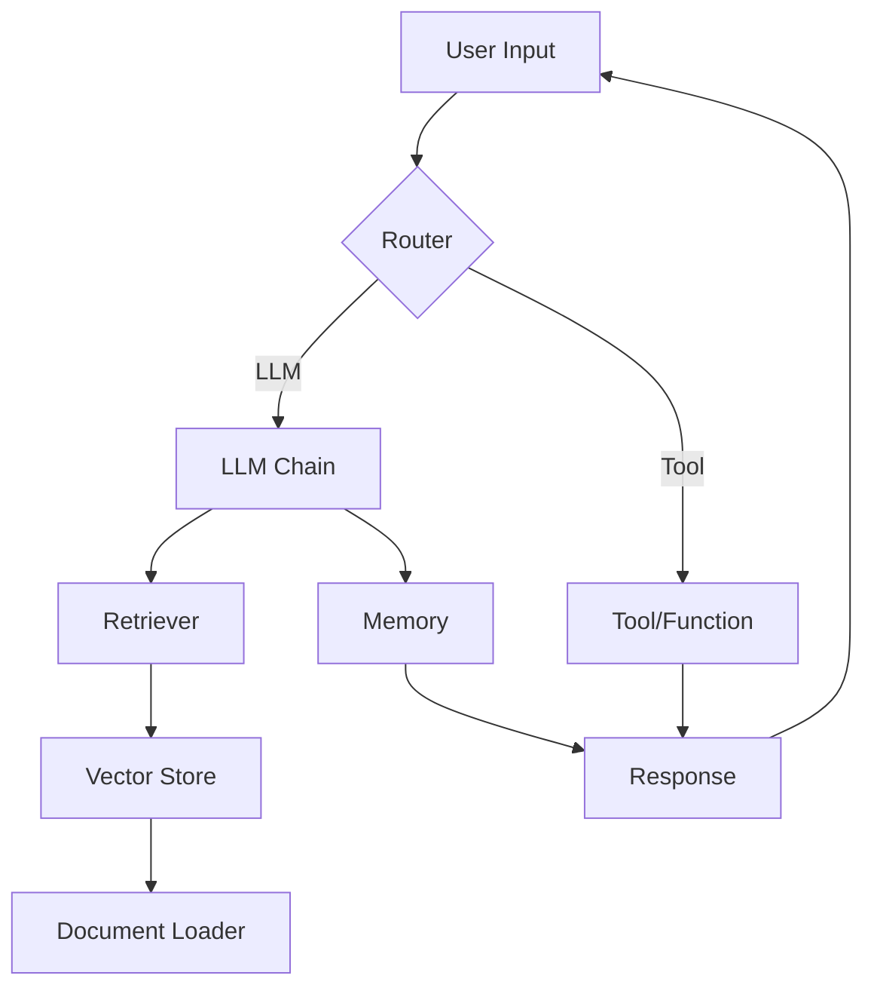

# LangChain Chatbot

## Table of Contents
- [Overview](#overview)
- [Features](#features)
- [Architecture](#architecture)
- [Installation](#installation)
- [Quick Start](#quick-start)
- [Advanced Usage](#advanced-usage)
- [Retrieval‑Augmented Generation (RAG)](#retrieval-augmented-generation-rag)
- [Testing](#testing)
- [Contributing](#contributing)
- [License](#license)

---

## Overview

`langchain-chatbot` is a **modular, extensible chatbot** built on top of **[LangChain](https://github.com/langchain-ai/langchain)**. It demonstrates how to combine LLMs, memory, and external knowledge sources using the **Retrieval‑Augmented Generation (RAG)** pattern. The project is deliberately lightweight so developers can focus on the core concepts while having a production‑ready baseline to extend.

---

## Features

- **LLM‑agnostic** – works with OpenAI, Anthropic, Cohere, Llama‑2, etc. (any LangChain‑compatible model).
- **Memory support** – conversation history persisted in‑memory or via Redis/SQL back‑ends.
- **RAG pipeline** – document ingestion, vector store indexing, similarity search, and context stitching.
- **Plug‑and‑play tools** – tool‑calling, function calling, and custom tool integration.
- **Dockerised development** – ready‑to‑run container with all dependencies.
- **Extensive tests** – unit and integration tests using `pytest` and `langchain‑testutils`.

---

## Architecture



- **Router** decides whether the query should be answered directly by the LLM or requires a tool (e.g., web search, calculator).
- **Retriever** fetches relevant documents from a vector store (FAISS, Chroma, Pinecone, etc.).
- **Memory** stores past interactions to provide context.
- **LLM Chain** combines the retrieved context with the user prompt and sends it to the LLM.

---

## Installation

### Prerequisites
- Python **3.9+**
- `git`
- (Optional) Docker & Docker‑Compose for containerised workflow

### Steps
```bash
# Clone the repository
git clone https://github.com/your-org/langchain-chatbot.git
cd langchain-chatbot

# Create a virtual environment
python -m venv .venv
source .venv/bin/activate  # on Windows: .venv\Scripts\activate

# Install dependencies
pip install -r requirements.txt
```

#### Environment variables
Create a `.env` file at the project root:
```dotenv
# LLM provider (OPENAI, ANTHROPIC, COHERE, ...)
LLM_PROVIDER=OPENAI
OPENAI_API_KEY=sk-...

# Vector store configuration (example using Chroma)
VECTOR_STORE=chroma
CHROMA_PERSIST_DIR=./chroma_data
```

---

## Quick Start

```bash
# Run the chatbot locally
python -m src.main
```

You will be presented with an interactive REPL. Try a simple query:
```
> What are the main benefits of Retrieval‑Augmented Generation?
```
The bot will retrieve relevant documents from the default demo corpus, augment the LLM prompt, and return a concise answer.

---

## Advanced Usage

### Custom Document Loader
Replace the default loader with your own (e.g., PDFs, CSVs, websites):
```python
from src.loaders import MyCustomLoader
loader = MyCustomLoader(path="./data")
documents = loader.load()
```

### Switching Vector Stores
```python
from langchain.vectorstores import FAISS
vector_store = FAISS.from_documents(documents, embedding)
```
Update `VECTOR_STORE` in `.env` to `faiss` and the chatbot will automatically use the new store.

### Adding Tools
```python
from src.tools import CalculatorTool, SearchTool
tools = [CalculatorTool(), SearchTool()]
router = Router(tools=tools)
```
Now the bot can perform calculations or web searches when the LLM requests them.

---

## Retrieval‑Augmented Generation (RAG)

RAG combines **retrieval** (searching a knowledge base) with **generation** (LLM response). This approach:
1. **Improves factual accuracy** – the LLM grounds its answer in real documents.
2. **Reduces hallucinations** – the model sees the exact source text.
3. **Enables domain‑specific knowledge** without fine‑tuning the model.

### How it works in this repo
1. **Document ingestion** – `src/loaders/` parses raw files into `Document` objects.
2. **Embedding** – each document is embedded using the model’s embedding API.
3. **Indexing** – embeddings are stored in a vector store for fast similarity search.
4. **Query** – user input is embedded, the nearest documents are fetched, and their content is concatenated.
5. **Prompt construction** – the retrieved snippets are injected into a system prompt template.
6. **LLM generation** – the LLM produces the final answer.

### Tips for Better RAG
- **Chunk size**: 500‑1000 tokens per chunk works well for most models.
- **Metadata**: store source IDs and timestamps to enable citations.
- **Hybrid search**: combine dense vectors with BM25 for improved recall.

---

## Testing

```bash
# Run the full test suite
pytest -v
```
The repository includes:
- Unit tests for loaders, vector store adapters, and routing logic.
- Integration tests that spin up a temporary LLM mock.
- Coverage reports (`pytest --cov=src`).

---

## Contributing

We welcome contributions! Please follow these steps:
1. **Fork** the repository.
2. **Create a feature branch** (`git checkout -b feat/your-feature`).
3. **Write tests** for new functionality.
4. **Run linting** (`ruff check .` and `black .`).
5. **Submit a Pull Request** with a clear description of the change.

See `CONTRIBUTING.md` for the full guideline and code‑style conventions.

---

## License

Distributed under the **MIT License**. See `LICENSE` for more information.

---

## Acknowledgements

- **LangChain** – the core framework enabling composable LLM applications.
- **FAISS / Chroma / Pinecone** – vector store back‑ends used for similarity search.
- **OpenAI, Anthropic, Cohere** – LLM providers supported out‑of‑the‑box.
