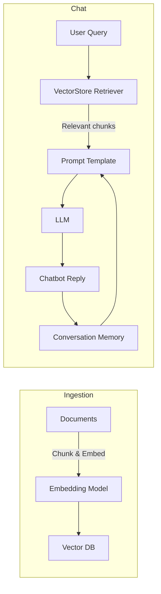

# LangChain Chatbot with Retrieval‑Augmented Generation (RAG)

[](LICENSE)
[](https://www.python.org/downloads/)

A **minimal yet extensible** reference implementation of a conversational chatbot built on **[LangChain](https://python.langchain.com/)** that demonstrates **Retrieval‑Augmented Generation (RAG)**.  The bot can answer questions over a custom knowledge base, keep conversation context, and be easily extended with new LLMs, vector stores, or UI front‑ends.

---

## Table of Contents

- [Features](#features)
- [Architecture Overview](#architecture-overview)
- [Quick Start](#quick-start)
  - [Prerequisites](#prerequisites)
  - [Installation](#installation)
  - [Running the Demo](#running-the-demo)
- [How It Works](#how-it-works)
  - [Document Ingestion & Indexing](#document-ingestion--indexing)
  - [Retrieval & Generation Pipeline](#retrieval--generation-pipeline)
- [Configuration](#configuration)
- [Testing](#testing)
- [Contributing](#contributing)
- [License](#license)

---

## Features

- **RAG‑powered** answering over user‑provided documents (PDF, TXT, Markdown, etc.).
- **Modular design** – swap LLMs, embeddings, or vector stores with a single line change.
- **Conversation memory** using LangChain's `ConversationBufferMemory` (or alternatives).
- **CLI & Streamlit UI** examples included.
- **Typed settings** via `pydantic` for easy configuration and validation.
- **Unit tests** covering ingestion, retrieval, and end‑to‑end chat flow.

---

## Architecture Overview



1. **Ingestion** – Documents are split into chunks, embedded with a chosen embedding model (e.g., OpenAI `text-embedding-ada-002`), and stored in a vector DB (currently `FAISS`).
2. **Retrieval** – At query time the retriever fetches the top‑k most relevant chunks.
3. **Generation** – A prompt template combines the retrieved context with the conversation history and sends it to the LLM.
4. **Memory** – The conversation history is persisted in‑memory (or optionally in a durable store) to maintain context across turns.

---

## Quick Start

### Prerequisites

- Python **3.9** or newer.
- An OpenAI API key (or another LLM provider key) with access to the embedding and chat models you intend to use.
- Optional: `git` for cloning the repository.

### Installation

```bash
# Clone the repository
git clone https://github.com/your-org/langchain-chatbot.git
cd langchain-chatbot

# Create a virtual environment (recommended)
python -m venv .venv
source .venv/bin/activate   # on Windows: .venv\Scripts\activate

# Install dependencies
pip install -r requirements.txt
```

> **Tip**: The `requirements.txt` pins compatible versions of `langchain`, `openai`, `faiss-cpu`, and `python-dotenv`.

### Running the Demo

1. **Create a `.env` file** at the project root:

   ```dotenv
   OPENAI_API_KEY=sk-xxxxxxxxxxxxxxxxxxxxxxxxxxxxxxxx
   ```

2. **Add documents** you want the bot to know about to the `data/` folder (supported formats: `.txt`, `.md`, `.pdf`).

3. **Index the documents** (run once or whenever you add new files):

   ```bash
   python scripts/index_documents.py
   ```

4. **Start the chatbot** – two options are provided:

   - **CLI**:
     ```bash
     python scripts/chat_cli.py
     ```
   - **Streamlit UI** (interactive web UI):
     ```bash
     streamlit run app/streamlit_chat.py
     ```

---

## How It Works

### Document Ingestion & Indexing

The script `scripts/index_documents.py` performs the following steps:

```python
loader = DirectoryLoader("data", glob="*.pdf", loader_cls=PyPDFLoader)
texts = loader.load_and_split(TextSplitter(chunk_size=1000, chunk_overlap=200))
embeddings = OpenAIEmbeddings()
vector_store = FAISS.from_documents(texts, embeddings)
vector_store.save_local("index")
```

- **Loaders** – LangChain provides a `DirectoryLoader` with format‑specific loaders (PDF, TXT, etc.).
- **Chunking** – `RecursiveCharacterTextSplitter` (or a custom splitter) creates overlapping chunks for better context.
- **Embeddings** – Replace `OpenAIEmbeddings` with `HuggingFaceEmbeddings`, `CohereEmbeddings`, etc., by updating `config.yaml`.
- **Vector store** – The index is persisted locally under `index/`.  Swap to a remote store (e.g., Pinecone, Weaviate) by changing the `vector_store` class.

### Retrieval & Generation Pipeline

`app/streamlit_chat.py` (or the CLI counterpart) builds the LangChain chain:

```python
retriever = FAISS.load_local("index", OpenAIEmbeddings()).as_retriever(search_kwargs={"k": 4})
memory = ConversationBufferMemory(memory_key="chat_history", return_messages=True)
qa_chain = RetrievalQA.from_chain_type(
    llm=ChatOpenAI(model_name="gpt-4o-mini"),
    chain_type="stuff",
    retriever=retriever,
    memory=memory,
    return_source_documents=True,
)
```

- **Retriever** – fetches the top‑k relevant chunks.
- **Prompt** – the default "stuff" chain concatenates retrieved chunks with the chat history.
- **LLM** – any `BaseChatModel` subclass works (OpenAI, Anthropic, Llama‑CPP, etc.).
- **Memory** – automatically injects prior turns, enabling multi‑turn dialogue.

---

## Configuration

All tunable parameters live in `config.yaml`. Example:

```yaml
embedding_model: text-embedding-ada-002
llm:
  provider: openai
  model: gpt-4o-mini
  temperature: 0.2
retriever:
  k: 4
chunking:
  size: 1000
  overlap: 200
vector_store: faiss
```

You can override values via environment variables or by passing a custom `Config` object to the scripts.

---

## Testing

The repository includes a small test suite using `pytest`.

```bash
pytest -q
```

Key test modules:
- `tests/test_ingest.py` – validates document loading and vector store creation.
- `tests/test_chat.py` – end‑to‑end test of the retrieval‑generation pipeline with a mock LLM.

---

## Contributing

Contributions are welcome! Please follow these steps:

1. **Fork the repository** and create a feature branch.
2. **Write tests** for any new functionality.
3. **Update documentation** (README, docstrings, or `docs/`).
4. **Run the full test suite** before submitting a PR.
5. **Submit a pull request** with a clear description of the changes.

See `CONTRIBUTING.md` for detailed guidelines on coding style, linting (`ruff`), and commit message conventions.

---

## License

This project is licensed under the **MIT License** – see the `LICENSE` file for details.

---

*Happy building with LangChain!*