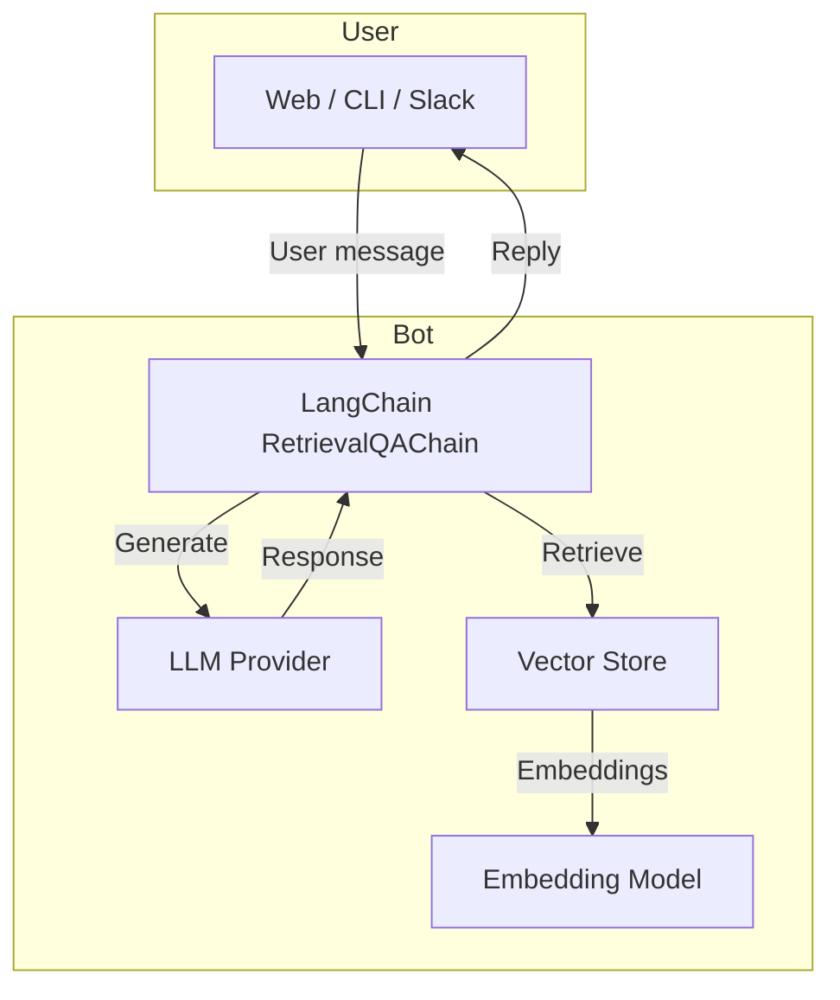

# LangChain Chatbot

## Table of Contents
- [Overview](#overview)
- [Features](#features)
- [Architecture](#architecture)
- [Installation](#installation)
- [Quick Start](#quick-start)
- [Advanced Usage](#advanced-usage)
  - [Retrieval‑Augmented Generation (RAG)](#retrieval‑augmented-generation-rag)
  - [Custom Prompt Templates](#custom-prompt-templates)
  - [Streaming Responses](#streaming-responses)
- [Testing](#testing)
- [Contributing](#contributing)
- [License](#license)

---

## Overview

`langchain-chatbot` is a minimal yet extensible reference implementation of a conversational AI built on **LangChain**. It demonstrates how to combine:

- **LLM back‑ends** (OpenAI, Anthropic, Llama 2, etc.)
- **Vector stores** for document retrieval (FAISS, Chroma, Pinecone, etc.)
- **Retrieval‑Augmented Generation (RAG)** to ground responses in external knowledge
- **Prompt engineering** and **memory** to maintain context across turns

The project is deliberately lightweight so developers can fork, extend, and integrate it into larger systems (e.g., Slack bots, web UIs, voice assistants).

---

## Features

- 📚 **RAG pipeline** – retrieve relevant chunks from a vector store and feed them to the LLM.
- 🧠 **Conversation memory** – optional `ConversationBufferMemory` to preserve dialogue history.
- ⚙️ **Modular components** – swap LLMs, embeddings, and vector stores via configuration.
- 🛠️ **Typed settings** – Pydantic models for reproducible runs.
- 🔁 **Streaming output** – optional token‑by‑token streaming for real‑time UI.
- ✅ **Test suite** – unit tests covering the core chain and retrieval logic.

---

## Architecture



- **User Interface** – any front‑end can call the `ask(question: str)` function exposed by `app/main.py`.
- **RetrievalQAChain** – combines a retriever (vector store) and an LLM with a prompt template.
- **Vector Store** – currently uses **FAISS** for local development; can be swapped for a managed service.
- **Embedding Model** – defaults to `OpenAIEmbeddings`; configurable via environment.

---

## Installation

### Prerequisites
- Python **3.9+**
- An OpenAI API key (or other provider key) set as an environment variable (`OPENAI_API_KEY`).

### Steps
```bash
# Clone the repository
git clone https://github.com/your-org/langchain-chatbot.git
cd langchain-chatbot

# Create a virtual environment (optional but recommended)
python -m venv .venv
source .venv/bin/activate  # on Windows: .venv\Scripts\activate

# Install dependencies
pip install -r requirements.txt

# Install the package in editable mode (useful for development)
pip install -e .
```

### Environment variables
Create a `.env` file at the project root:
```dotenv
OPENAI_API_KEY=sk-****************
# Optional: change the default model
OPENAI_MODEL=gpt-4o-mini
# If you use a different vector store, set its credentials here
```

---

## Quick Start

The repository ships with a small demo dataset (`data/example_docs`). To launch a local REPL chatbot:

```bash
# Populate the vector store (runs once)
python scripts/build_index.py

# Start the interactive CLI
python -m app.cli
```

You will see a prompt like `>>>`. Type a question and the bot will respond using RAG.

---

## Advanced Usage

### Retrieval‑Augmented Generation (RAG)
The core RAG logic lives in `app/rag.py`. You can customise the retriever, the prompt, or the LLM by editing the `RAGConfig` Pydantic model.

```python
from app.rag import RAGChain, RAGConfig

config = RAGConfig(
    llm_model="gpt-4o-mini",
    embedding_model="text-embedding-3-large",
    vector_store="faiss",
    top_k=5,
    use_memory=True,
)
chain = RAGChain(config)
response = chain.run("Explain the difference between supervised and unsupervised learning.")
```

### Custom Prompt Templates
Create a Jinja2 template under `templates/` and reference it in the config:

```yaml
prompt_template: "templates/custom_prompt.jinja"
```

The template receives the variables `question`, `context`, and optionally `chat_history`.

### Streaming Responses
To enable token‑by‑token streaming (useful for UI progress bars), set the `stream` flag when initializing the LLM:

```python
from langchain.llms import OpenAI

llm = OpenAI(streaming=True, callbacks=[MyStreamingCallback()])
```

---

## Testing

The project uses **pytest**. Run the full suite with:

```bash
pytest -vv
```

Unit tests cover:
- Vector‑store indexing (`tests/test_index.py`)
- RetrievalQAChain behaviour (`tests/test_rag.py`)
- CLI interaction (`tests/test_cli.py`)

---

## Contributing

Contributions are welcome! Follow these steps:

1. Fork the repository.
2. Create a feature branch (`git checkout -b feat/your-feature`).
3. Write tests for any new functionality.
4. Ensure linting passes (`ruff check .`).
5. Open a Pull Request with a clear description of the change.

### Code style
- Use **ruff** for formatting and linting.
- Type hints are required for all public functions.
- Keep imports alphabetically sorted.

### Development workflow
```bash
# Install dev dependencies
pip install -r dev-requirements.txt

# Run the linter
ruff check .

# Run type checking
mypy .
```

---

## License

This project is licensed under the **MIT License** – see the `LICENSE` file for details.
