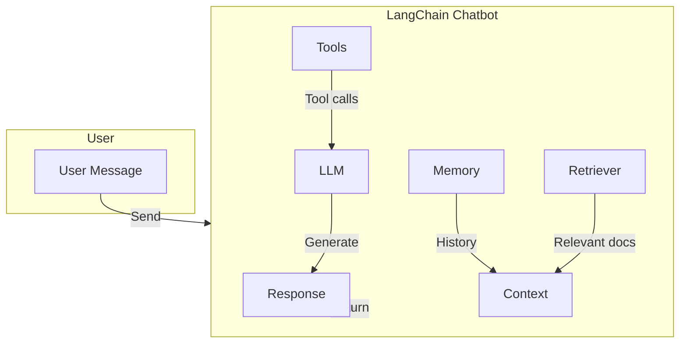

# LangChain Chatbot with Retrieval‑Augmented Generation (RAG)

[](LICENSE)
[](https://www.python.org/downloads/)
[](https://github.com/langchain-ai/langchain)

---

## 📖 Overview

**LangChain‑Chatbot** is a minimal yet extensible reference implementation of a conversational AI assistant built on top of **[LangChain](https://github.com/langchain-ai/langchain)**.  It demonstrates how to combine:

* **LLM‑driven generation** (OpenAI, Anthropic, Llama, etc.)
* **Retrieval‑Augmented Generation (RAG)** – fetching relevant documents from a vector store and injecting them into the prompt
* **Tool‑use** – optional integration with external APIs (e.g., web search, calculator)
* **Conversation memory** – preserving context across turns

The repository is intentionally lightweight so developers can fork, adapt, and extend it for their own use‑cases (customer support bots, knowledge‑base assistants, internal help desks, …).

---

## ✨ Features

- **Modular architecture** – separate modules for LLM, vector store, retriever, memory and tools.
- **Pluggable vector stores** – supports FAISS, Chroma, Pinecone, Weaviate, etc.
- **Config‑driven** – all components are configurable via a single `config.yaml` file.
- **Docker ready** – a `Dockerfile` and `docker-compose.yml` for quick local deployment.
- **Extensive type‑hints & docstrings** – IDE‑friendly development experience.
- **Test suite** – unit tests for the core pipeline (pytest).
- **CI workflow** – GitHub Actions linting and testing on push.

---

## 🏗️ Architecture Overview



1. **Retriever** queries a vector store with the user query and returns the top‑k relevant passages.
2. **Memory** (ConversationBufferMemory) concatenates prior turns to preserve context.
3. **Prompt template** merges the retrieved passages, memory, and the current user query.
4. **LLM** generates the final answer. If the LLM decides to call a tool, LangChain's `AgentExecutor` handles the tool invocation and loops back.

---

## 📦 Installation

### Prerequisites

- Python **3.9** or newer
- An OpenAI API key (or any other supported LLM provider)
- (Optional) Docker & Docker‑Compose for containerised execution

### Using `pip`

```bash
# Clone the repository
git clone https://github.com/your‑org/langchain-chatbot.git
cd langchain-chatbot

# Create a virtual environment
python -m venv .venv
source .venv/bin/activate   # on Windows: .venv\Scripts\activate

# Install dependencies
pip install -r requirements.txt
```

### Environment variables

Create a `.env` file at the project root:

```dotenv
# LLM provider (openai, anthropic, ...)
LLM_PROVIDER=openai
OPENAI_API_KEY=sk-****

# Vector store configuration (example for FAISS)
VECTORSTORE=faiss
FAISS_INDEX_PATH=data/faiss_index

# Optional: Pinecone credentials
# PINECONE_API_KEY=...
# PINECONE_ENV=...
```

---

## 🚀 Quick Start

```bash
# Load documents (e.g., from a folder of PDFs or markdown files)
python scripts/load_documents.py --source data/docs

# Build / update the vector store
python scripts/create_vectorstore.py

# Run the chatbot (CLI mode)
python app/main.py
```

You will be greeted with a simple REPL where you can type queries:

```
> What is the refund policy?
[Bot] According to the policy document, refunds are available within 30 days …
```

### Running with Docker

```bash
docker compose up --build
```

The service will be exposed on `http://localhost:8000`.  You can interact via the provided Swagger UI or any HTTP client.

---

## 🛠️ Development & Contribution

### Code structure

```
langchain_chatbot/
├── app/                # FastAPI entry point (HTTP API)
├── core/               # Core LangChain wrappers (retriever, memory, tools)
├── scripts/            # Helper scripts for data ingestion & indexing
├── tests/              # pytest suite
├── config.yaml         # Default configuration (overridden by .env)
└── README.md
```

### Adding a new vector store
1. Implement a class inheriting from `BaseVectorStore` in `core/vectorstores/`.
2. Register the class in `core/factory.py`.
3. Update `config.yaml` with the new store name.
4. Add unit tests under `tests/vectorstores/`.

### Adding a new tool
1. Create a function in `core/tools/` with a clear docstring.
2. Wrap it with `langchain.tools`' `Tool` class.
3. Add the tool to the `ToolRegistry` in `core/factory.py`.
4. Document usage in the **Examples** section below.

### Testing

```bash
pytest -q
```

All tests must pass before opening a pull request.

### Linting & Formatting

```bash
pip install pre-commit
pre-commit install
pre-commit run --all-files
```

---

## 📚 Examples

### Simple Q&A

```python
from langchain_chatbot.core import Chatbot

bot = Chatbot()
print(bot.ask("How do I reset my password?"))
```

### Using a custom tool (calculator)

```python
from langchain_chatbot.core import Chatbot, ToolRegistry

# Register a simple calculator tool
ToolRegistry.register("calculator", lambda expr: str(eval(expr)))

bot = Chatbot()
print(bot.ask("What is 12 * 7?"))
```

### RAG with a large knowledge base

```bash
# Ingest a directory of markdown files
python scripts/load_documents.py --source data/knowledge_base

# Re‑index
python scripts/create_vectorstore.py --rebuild

# Start the bot
python app/main.py
```

Now the bot can answer queries that require information from the entire knowledge base, e.g.,

```
> Explain the onboarding process for new employees.
[Bot] According to the *Employee Handbook* (section 3.2)...
```

---

## 🤝 Contributing

We welcome contributions! Please follow these steps:

1. Fork the repository.
2. Create a feature branch (`git checkout -b feature/awesome‑feature`).
3. Write tests for your changes.
4. Ensure the full test suite passes.
5. Open a Pull Request with a clear description of the change.

See `CONTRIBUTING.md` for detailed guidelines.

---

## 📄 License

This project is licensed under the **MIT License** – see the [LICENSE](LICENSE) file for details.

---

## 📞 Contact & Support

- **Maintainer:** Your Name (<your.email@example.com>)
- **Discord:** `#langchain-chatbot` on the LangChain community server
- **Issues:** Use GitHub Issues for bug reports and feature requests.

---
