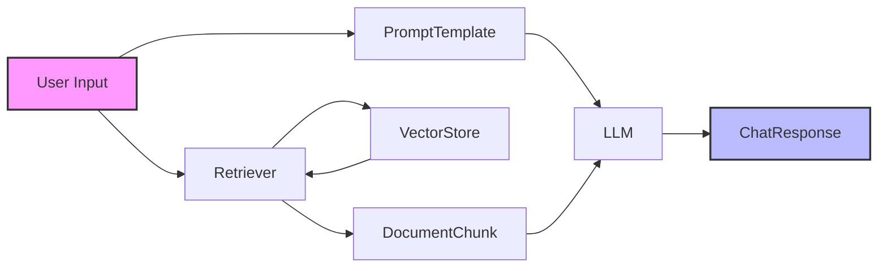

# LangChain Chatbot

A **LangChain-powered chatbot** that demonstrates Retrieval‑Augmented Generation (RAG) using vector stores, LLMs, and modular chain components.  This repository provides a minimal yet extensible template for building conversational agents that can retrieve relevant context from external data sources and generate informed responses.

---

## Table of Contents

- [Features](#features)
- [Architecture Overview](#architecture-overview)
- [Getting Started](#getting-started)
  - [Prerequisites](#prerequisites)
  - [Installation](#installation)
  - [Running the Demo](#running-the-demo)
- [Project Structure](#project-structure)
- [Usage Examples](#usage-examples)
- [Configuration](#configuration)
- [Testing](#testing)
- [Contributing](#contributing)
- [License](#license)

---

## Features

- **RAG pipeline**: Combine a vector store (FAISS, Chroma, etc.) with a Large Language Model (LLM) to retrieve relevant documents and generate context‑aware answers.
- **Modular chain design**: Easily swap out components (retriever, LLM, prompt templates) thanks to LangChain's composable `Chain` API.
- **Extensible data ingestion**: Supports loading text, PDFs, CSVs, and custom loaders.
- **Docker support**: Run the chatbot in an isolated container for reproducible environments.
- **Unit & integration tests**: Example tests using `pytest` and LangChain's mock utilities.

---

## Architecture Overview



1. **Retriever** queries the vector store for the most relevant document chunks.
2. Retrieved documents are injected into a **PromptTemplate** that guides the LLM.
3. The LLM generates a response, which is returned to the user.

---

## Getting Started

### Prerequisites

- Python **3.9** or newer
- `pip` (>= 23.0) or `uv` for faster installs
- Optional: Docker & Docker‑Compose if you prefer containerised execution

### Installation

```bash
# Clone the repository
git clone https://github.com/your‑org/langchain-chatbot.git
cd langchain-chatbot

# Create a virtual environment (recommended)
python -m venv .venv
source .venv/bin/activate   # On Windows use `.venv\Scripts\activate`

# Install dependencies
pip install -r requirements.txt
```

> **Tip**: If you use `uv`, replace the last line with `uv pip install -r requirements.txt` for a faster, deterministic install.

### Running the Demo

The repository ships with a small demo dataset (`data/sample_docs`). To start the chatbot locally:

```bash
python -m src.main --data-dir data/sample_docs
```

You will be presented with a simple CLI prompt. Type a question and press **Enter** to receive a RAG‑augmented answer.

---

## Project Structure

```
langchain-chatbot/
├─ data/                 # Sample documents for the demo
├─ src/
│   ├─ __init__.py
│   ├─ config.py        # Centralised configuration (LLM, embeddings, etc.)
│   ├─ loaders.py       # Document loaders (txt, pdf, csv…)
│   ├─ vector_store.py  # Wrapper around FAISS/Chroma
│   ├─ chain.py         # Construction of the RAG chain
│   └─ main.py          # CLI entry point
├─ tests/                # Pytest suite
├─ .env.example          # Example environment variables
├─ Dockerfile
├─ docker-compose.yml
├─ requirements.txt
└─ README.md
```

---

## Usage Examples

### 1. Simple CLI interaction (already shown above)

### 2. Programmatic usage

```python
from src.chain import get_rag_chain
from src.config import Settings

settings = Settings()
rag_chain = get_rag_chain(settings)

question = "What are the key benefits of Retrieval‑Augmented Generation?"
answer = rag_chain.invoke({"question": question})
print(answer)
```

### 3. Running as a FastAPI service

A minimal FastAPI wrapper is provided in `src.api`. To launch:

```bash
uvicorn src.api:app --host 0.0.0.0 --port 8000
```

Send a POST request to `/chat` with JSON `{ "question": "..." }` to receive the answer.

---

## Configuration

All configurable values live in `src/config.py` and can be overridden via environment variables (see `.env.example`). Common options include:

- `LLM_MODEL` – e.g., `gpt-3.5-turbo`, `mistral-7b`.
- `EMBEDDING_MODEL` – e.g., `text-embedding-ada-002`.
- `VECTOR_STORE` – `faiss` (default) or `chroma`.
- `TOP_K` – Number of retrieved documents (default: 4).

---

## Testing

```bash
pytest -v
```

The test suite covers:
- Document loading and chunking
- Vector store indexing & retrieval
- End‑to‑end RAG chain execution with a mock LLM

---

## Contributing

Contributions are welcome! Follow these steps:

1. Fork the repository.
2. Create a feature branch (`git checkout -b feat/your-feature`).
3. Write code and accompanying tests.
4. Ensure the test suite passes (`pytest`).
5. Open a Pull Request with a clear description of the change.

Please adhere to the existing code style (black, isort) and include documentation updates when adding new functionality.

---

## License

This project is licensed under the **MIT License** – see the `LICENSE` file for details.
